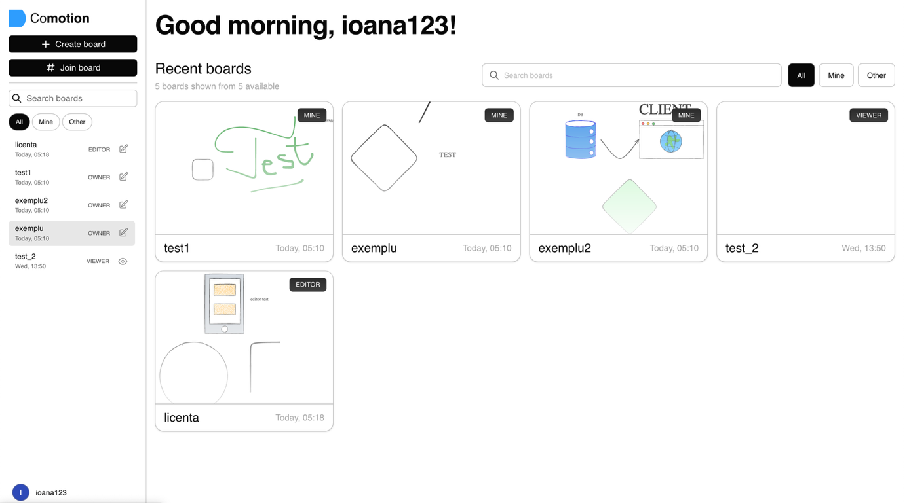
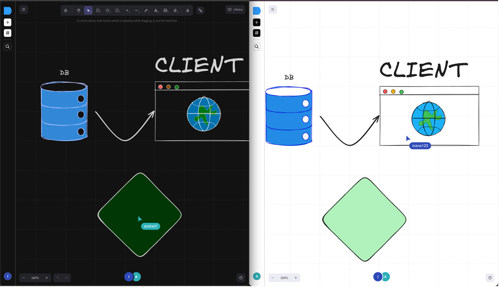

# Commotion

A collaborative Web app for real-time, cross-team board editing.

## Screenshots:

> Homepage view:



> Side-by-side view of 2 users editing the same board:



> Live demo of 3 users editing the same board:

<div style="position:relative; width:100%; height:0px; padding-bottom:62.500%"><iframe allow="fullscreen;autoplay" allowfullscreen height="100%" src="https://streamable.com/e/q8g8px?autoplay=1" width="100%" style="border:none; width:100%; height:100%; position:absolute; left:0px; top:0px; overflow:hidden;"></iframe></div>

## Installation:

To run this project, you need to have Node.js and npm installed on your machine. Follow the steps below to set up and run the project:

1. Clone repo:
```bash
git clone https://github.com/ioanamadaras/commotion
```

2. Navigate to project directory:
```bash
cd commotion
```

3. Install the dependencies and run the frontend:
```bash
cd client
npm install
npm run dev
```

> (In a separate terminal)

4. Define `MONGO_URI` / `JWT_SECRET` and `PORT` in a new .env file in the `/server` directory

5. Navigate to the server directory and install the dependencies:
```bash
cd server
npm install
npm run dev
```