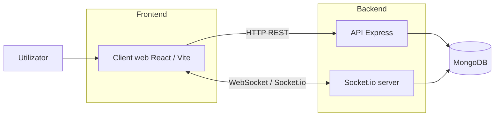
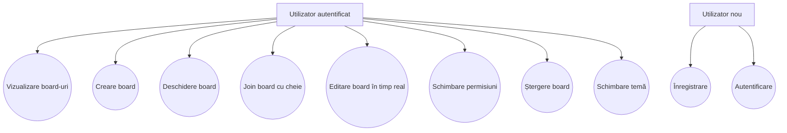
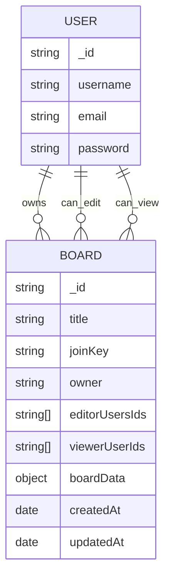
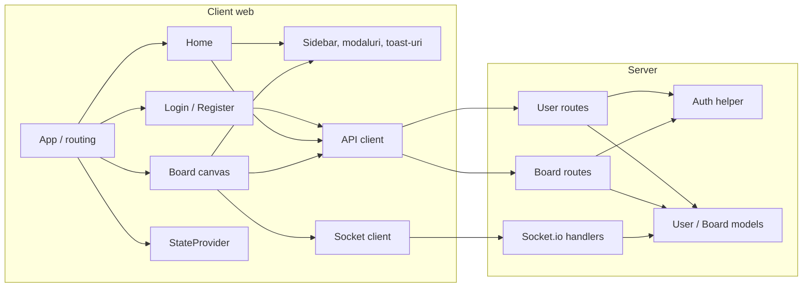
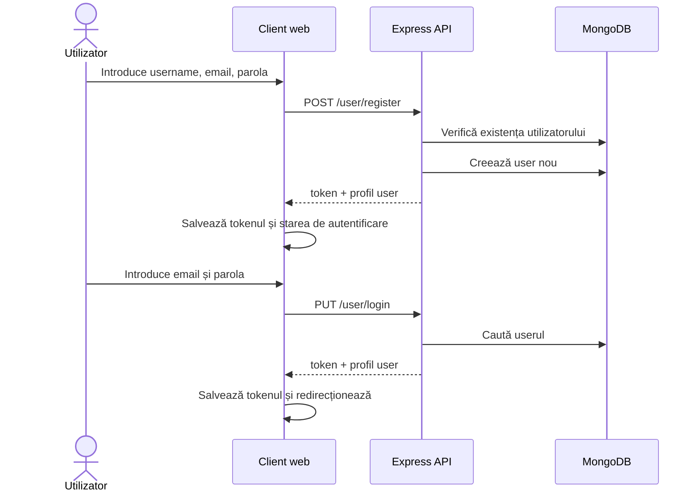
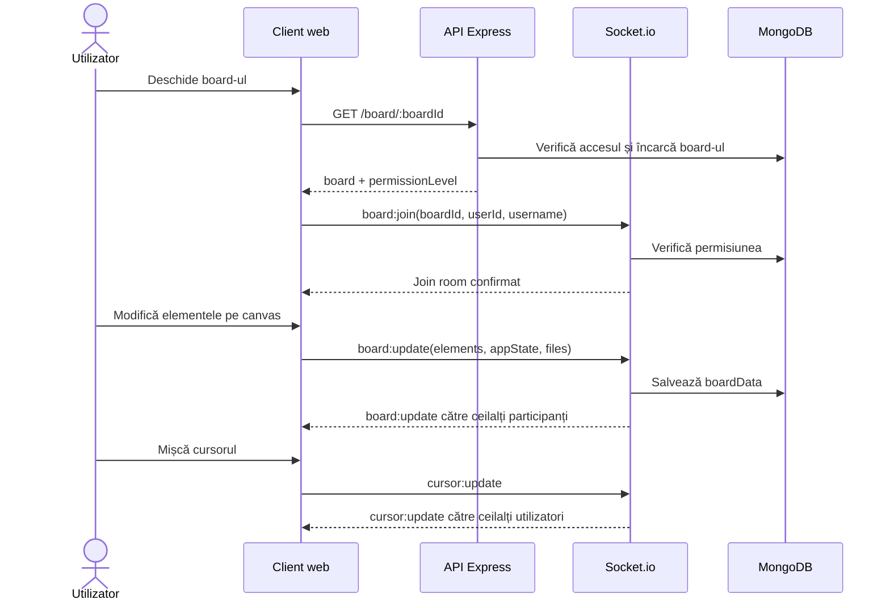
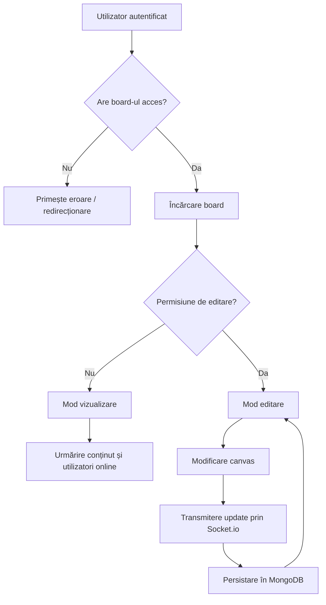

# Diagrame licență - Commotion

Acest fișier conține diagramele recomandate pentru lucrarea de licență, generate pe baza aplicației existente.

## 1. Arhitectura generală

## 2. Diagrama use case

## 3. Model de date

## 4. Diagramă de componente

## 5. Secvență: înregistrare și autentificare

## 6. Secvență: deschidere board și colaborare în timp real

## 7. Diagramă de activitate: gestionarea unui board

## Recomandare de folosire în lucrare

- Figura 1: Arhitectura generală a aplicației
- Figura 2: Cazuri de utilizare ale sistemului
- Figura 3: Modelul de date
- Figura 4: Diagrama de componente
- Figura 5: Secvența de înregistrare și autentificare
- Figura 6: Secvența de colaborare în timp real
- Figura 7: Fluxul de lucru pentru gestionarea unui board
